# Breadboard


Hey guys, I am a student in Shanghai. This week I learned how to use breadboard to build an Arduino. Here's a simple tutorial to follow.

Created by **LIU Xinyu**

Date: **2023/09/13-2023/09/14**


# 1. Prepare the required components

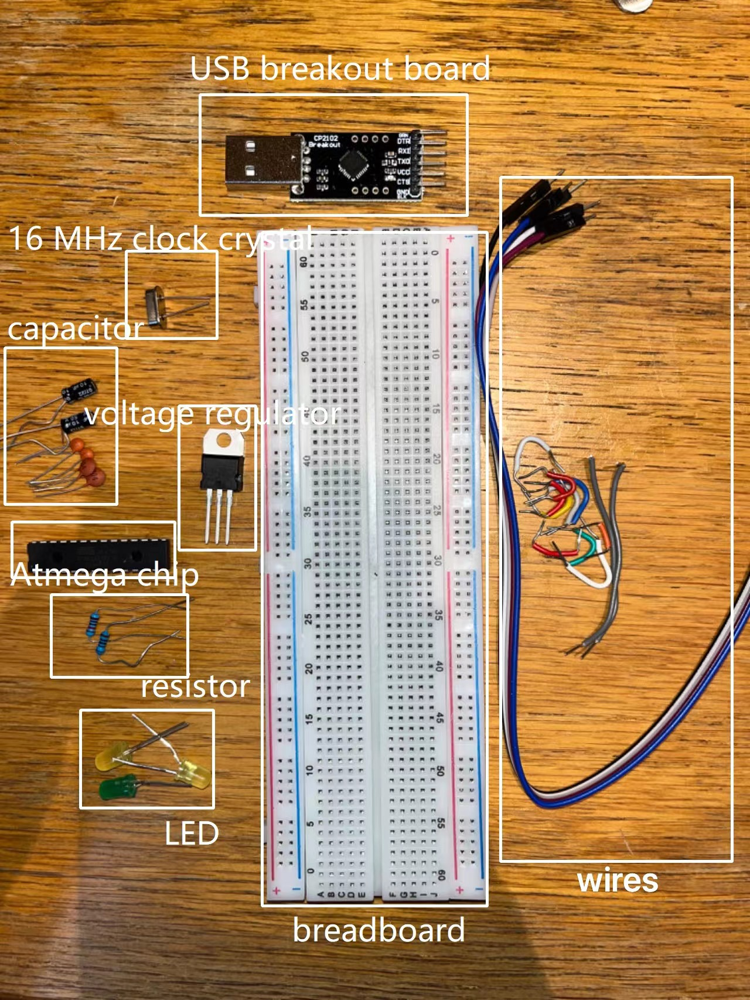

- **Breadboard*1**
- **Resistor**
    - 10kΩ*1
    - 220Ω*2
- **7805 Voltage regulator*1** - -’*05’->Maintain a stable voltage at 5V*
- **LEDs*3**
- **AWG wire** - -*American Wire Gauge(AWG)*
- **Capacitor**
    - 10μF*2 - -*Farad(F)*
    - 0.1μF*2
    - 22pF*2
- **16 MHz clock crystal** - -*Provide a stable clock signal*
- **Atmega chip**
- **CP2102 USB Breakout board**

Additionally, don’t forget to install the software—**Arduino IDE**.

# 2. Connect the base components

If you have already gathered all the components, let’s get started.

## Learn about breadboard

Here are some pictures that will illustrate the basic principles of a breadboard. They can help you establish a solid foundation and will come in handy for the subsequent wiring sections.

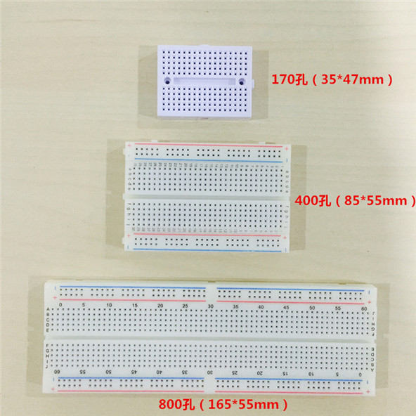

Several types of breadboard.

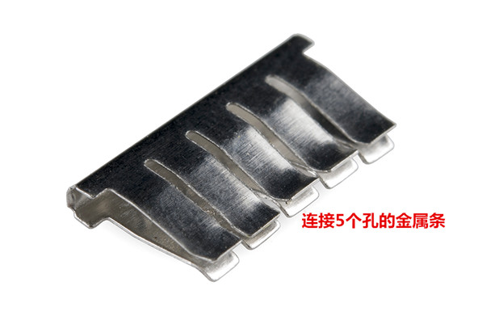

Internal structure of breadboard, metal strip with 5 holes.

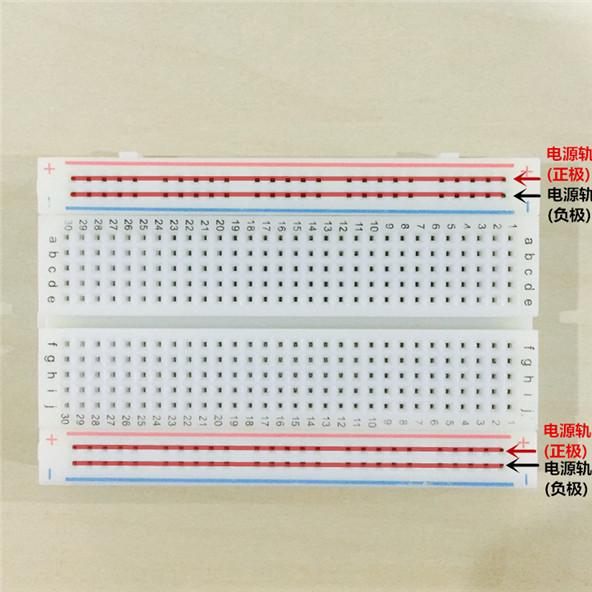

Red and blue lines are connected with positive and negative terminals of the power supply.

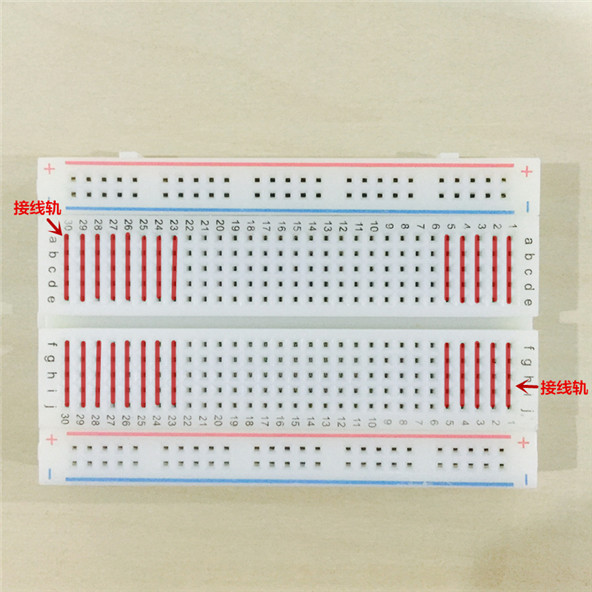

There are numbers and letters in the middle region, the tracks of letters a-e and f-j for the same number are connected, while tracks for different numbers are not connected.

## Add power lines, voltage regulator and capacitor

Make connections as shown in the diagram.


The two wires are connected to the positive(red) and negative(blue) terminals respectively. The purpose of this step is to establish connectivity between the left and right sides of the breadboard, enabling power supply to the Atmega board in the following steps.


As shown in the image, this voltage regulator has three pins: Input, Ground (GND), and Output. 
’7805’ means this device can regulate voltage to 5V.
When connecting the capacitor to the regulator, you should carefully observe the polarity of the capacitor. Do not connect it incorrectly, or the circuit will fail!

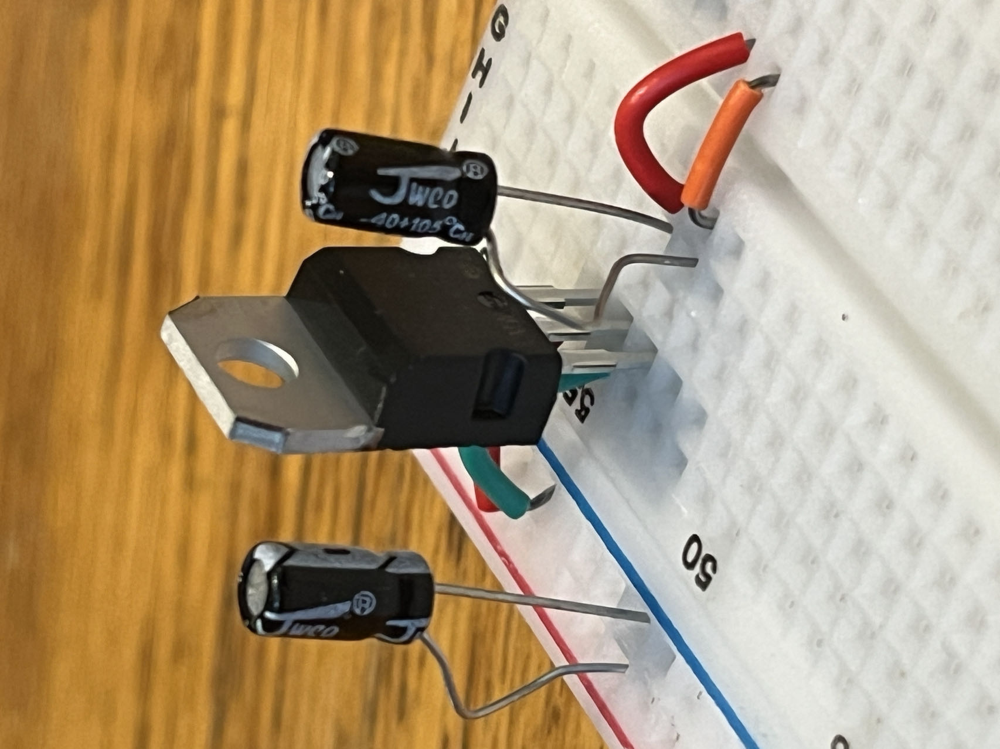

We should place a capacitor before and after the voltage regulator to ensure that the voltage remains stable at 5V.

## Add LED and resistor

Make connections as shown in the diagram.


Resistors don't have positive or negative terminals, but LEDs do. An LED has two 'legs'; one is longer and should be connected to the positive terminal on the breadboard, while the other one should be connected to the negative terminal.
The role of this resistor is protecting the circuit from strong current so that the LED won’t get broken.

## Add Atmega

Before we place Atmega on the breadboard, we do need to learn about Atmega.

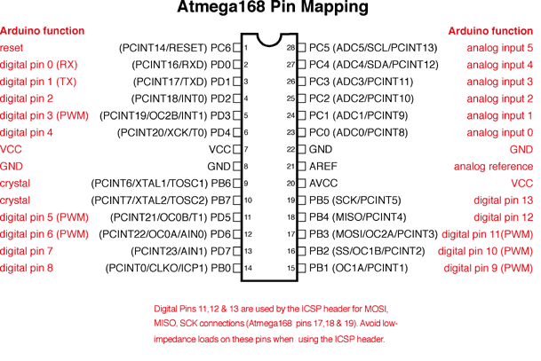

As you can see, an Atmega has 26 pins, and it has GND and VCC on both sides to provide power to the chip and the pins. It is the most important component in this project. We will know more details about it later.

Make connections as shown in the diagram. 

Attention! It must be put over the ‘gap’ of breadboard.

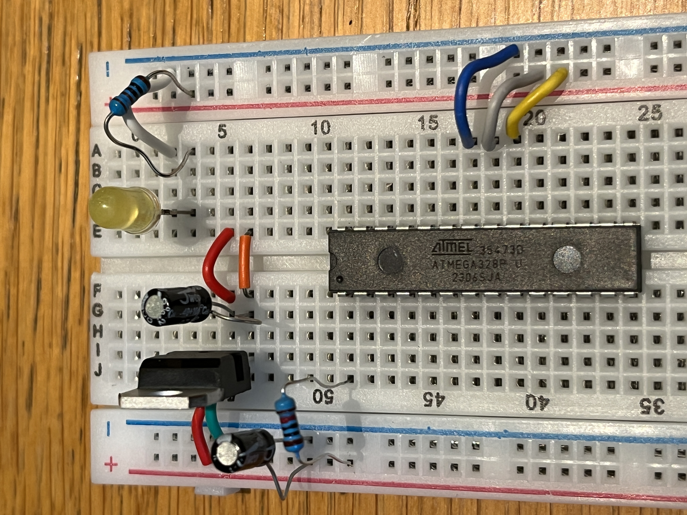

## Add resistor, capacitors and **crystal**

Make connections as shown in the diagram. 

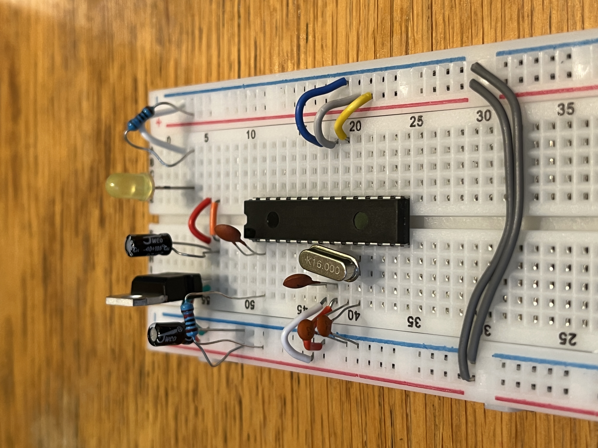

The crystal is used to control the timing of the circuit and it connects to two specific pins.

## Add **USB Breakout board**

To establish a connection between computer and this device, we need a USB breakout board.

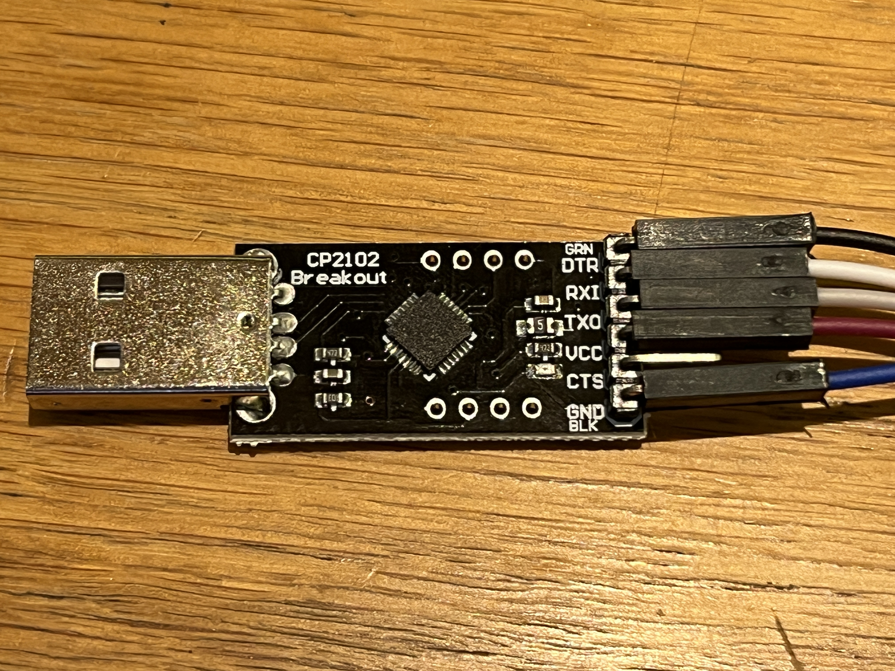

It has five pins, GND, CTS(we don’t need), VCC, TXO, RXI, DTR.

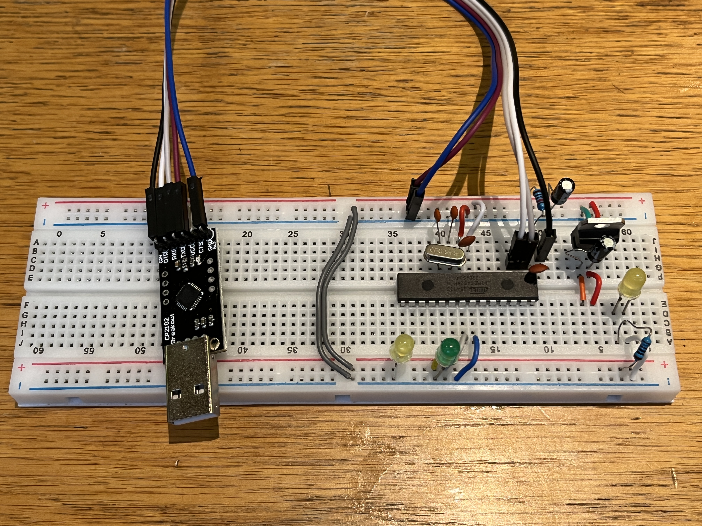

Attention! The receive and transmit ports of the USB breakout board should be connected to the transmit and receive ports of Atmega respectively.

# 3. Programming test

## Bright LED on Pin 13


```arduino
void setup() {
  pinMode(LED_BUILTIN, OUTPUT);
}

void loop() {
  digitalWrite(LED_BUILTIN, HIGH);
  delay(1000);// delay 1000ms, namely 1 second
  digitalWrite(LED_BUILTIN, LOW);
  delay(1000);
}
```

## Bright LED on Pin 9

```arduino
void setup() {
  pinMode(LED_BUILTIN, OUTPUT);
	pinMode(9, OUTPUT);
}

void loop() {
  digitalWrite(LED_BUILTIN, HIGH);
  digitalWrite(9, LOW);
	  delay(1000);x`
  digitalWrite(LED_BUILTIN, LOW);
  digitalWrite(9, HIGH);
  delay(1000);
}
```

## Learn to print

```arduino
int i=0;
void setup() {
  Serial.begin(9600);// opens serial port, sets data rate to 9600 bps
}

void loop() {
	i=i+1;
	Serial.print("I have told you ");
	Serial.print(i);
  Serial.println(" times!");//The difference between 'print' and 'println' is that 'ln' means it will insert a line break at the end of the sentence.
  delay(1000);
}
```

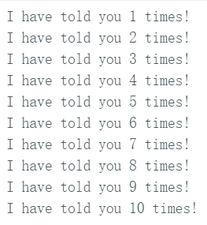

# 4. Summary

Up to now, we have learned the fundamental knowledge of circuits and are able to do basic programming using the Arduino IDE. In the next chapter, we will know more details the electronic components used in this chapter.
