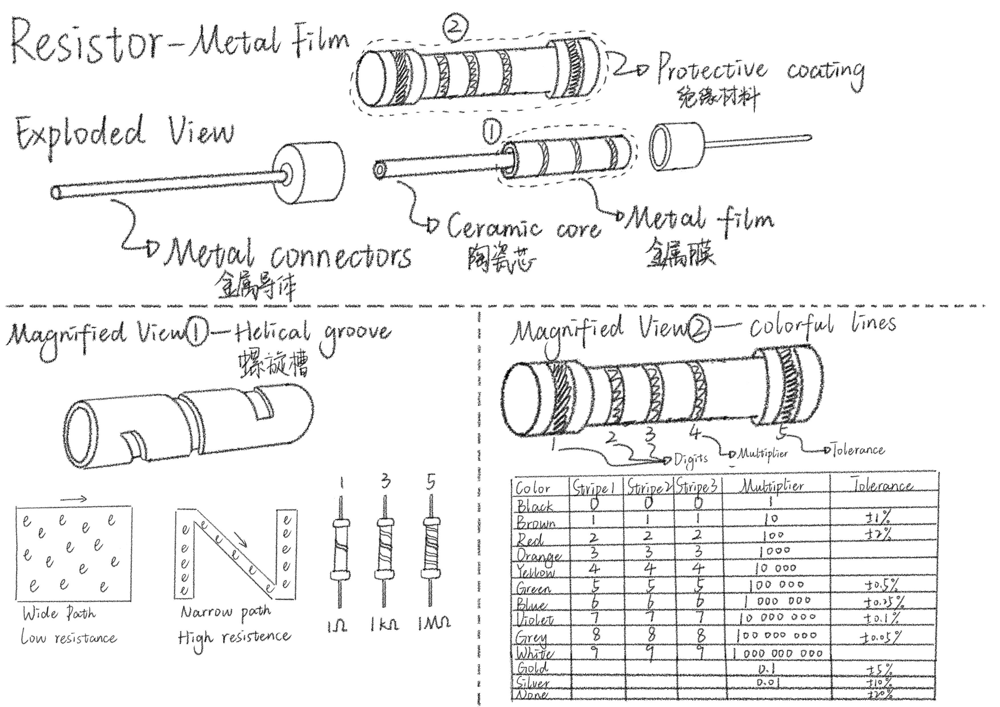

# Sketch

Hey guys, I am a student in Shanghai. On this weekend I drew a diagram about resistor.

Created by **LIU Xinyu**

Date: **2023/09/16-2023/09/17**

# 1. My sketch

When you hear about a resistor, you might think, ‘Oh, I know it, it is like friction, it is not good, it has a negative effect.’ But today I want to tell all of you that resistors are significant to circuits because they can protect them from strong current.

Now I'm going to introduce the commonly used — **metal film resistor**. 

At the top of this diagram, you can see exploded view of resistor. It consists of four parts. The innermost part is the ceramic core, covered with a metal film on the outside. It is connected to two metal connectors at both ends. The outermost layer is a protective coating.

At the left of this diagram, you can see magnified view of metal film, which has helical groove on it. The function of helical groove is to provide high resistance. You can see the diagram in the bottom left corner. It shows that the wider the path, the lower the resistance, and the narrower the path, the higher the resistance. There is one helical groove on the surface of a 1 Ohm resistor. There are three helical grooves on the surface of a 1 kilo Ohm resistor. And there are five helical grooves on the surface of a 1 million Ohm resistor.

At the right of this diagram, you can see magnified view of protective coating, which has colorful lines on it. The first three stripes are digits, they can be combined into a three-digit number. The fourth stripe is multiplier, you can use the number we just got to multiply by the multiplier, so you will know the Ohm value of any resistors. The fifth stripe is tolerance. The sheet in the bottom right corner shows us the relationship between colors and values. With its help, we can know the resistance value without having to use a detective device every time.
