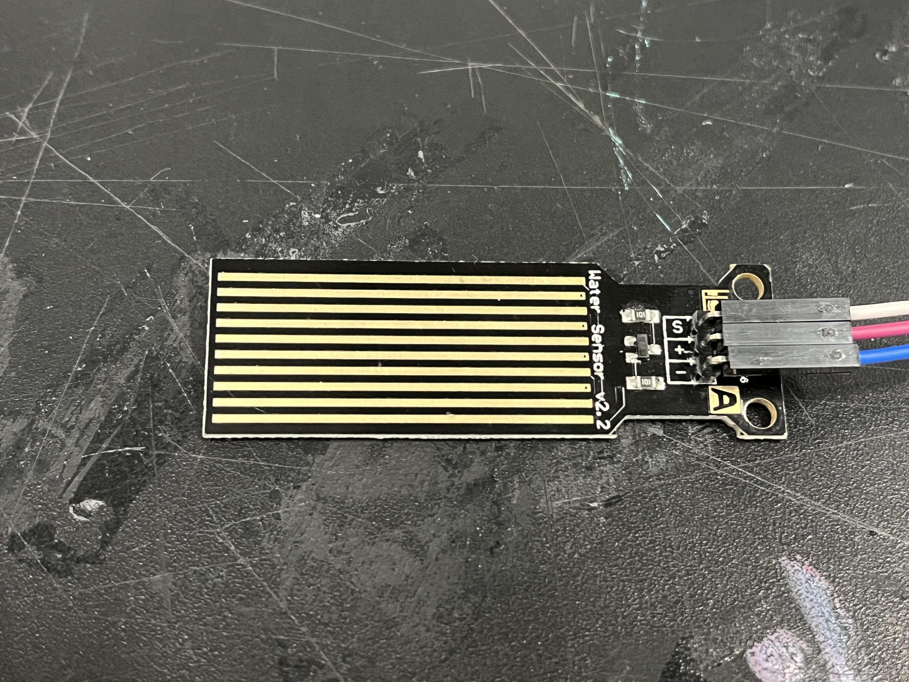
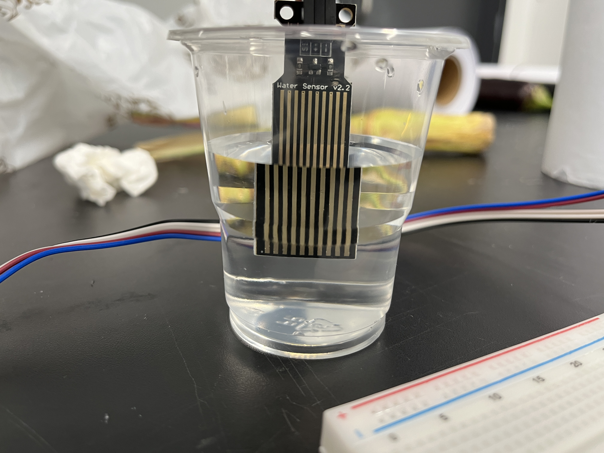
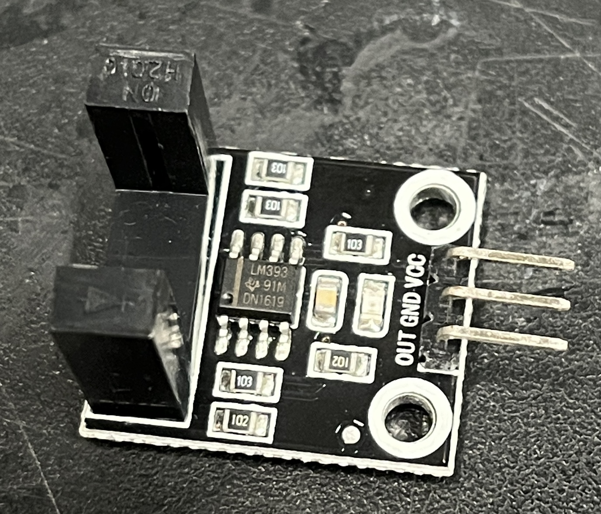
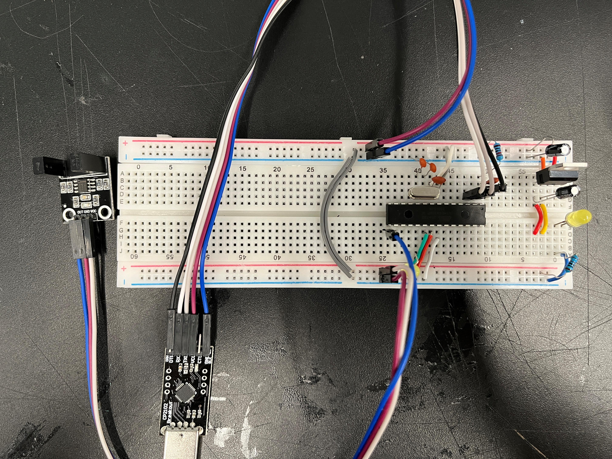

# Sensor


Hey guys, I am a student in Shanghai. On this weekend I learned digital signal and analog signal and I did two experiments with them.

Created by **LIU Xinyu**

Date: **2023/09/20**


# 1. Water sensor module (analog)



It is a water sensor that can measure water depth. It has three pins: a positive terminal, a negative terminal, and a signal. The signal pin must be connected to an analog pin (A0-A5) because it is an analog sensor.


As shown in this picture, I connect the signal pin with A0.

 You can use the following code to do this experiment.

```arduino
int water;

void setup() {
  Serial.begin(9600);
  pinMode(A0,INPUT);
}

void loop() {
  water = analogRead(A0);
  Serial.println(water);
  delay(100);
}
```



Prepare a cup of water and immerse the sensor into water.


When you don’t immerse it into water, Arduino serial monitor will just print 0.
When you immerse it into water, Arduino serial monitor will print values
When you immerse it deeper into water, value will get larger.

# 2. U-shaped photoelectric sensor module (digital)



It is a photoelectric sensor. It has three pins: a positive terminal(VCC), a negative terminal(GND), and a signal(OUT).



As shown in this picture, I connect the signal pin with 9.

 You can use the following code to do this experiment. We will use this sensor to control ‘ON’ or ‘OFF’ state of an LED.

```arduino
int value = 0;

void setup() {
  Serial.begin(9600);
  pinMode(9,INPUT);
  pinMode(13,OUTPUT);
}

void loop() {
  value = digitalRead(9);
  if(value == 1){
    digitalWrite(13,HIGH);
  }
  else{
    digitalWrite(13,LOW);
  }
  Serial.println(value);
  delay(1000);
}
```


When you don’t put something between the U shape sensor, Arduino serial monitor will just print 0 and pin 13 will be LOW, so LED connect to pin 13 won’t turn on.
When you put something between the U shape sensor, Arduino serial monitor will print 1 and pin 13 will be HIGH, so LED connect to pin 13 will turn on.

Following is outcome of this experiment.


# 3. Summary

Up to now, we have learned the fundamental knowledge of digital sensor and analog sensor. In the next chapter, we will go to a garden in Tongji University to explore urban nature!
