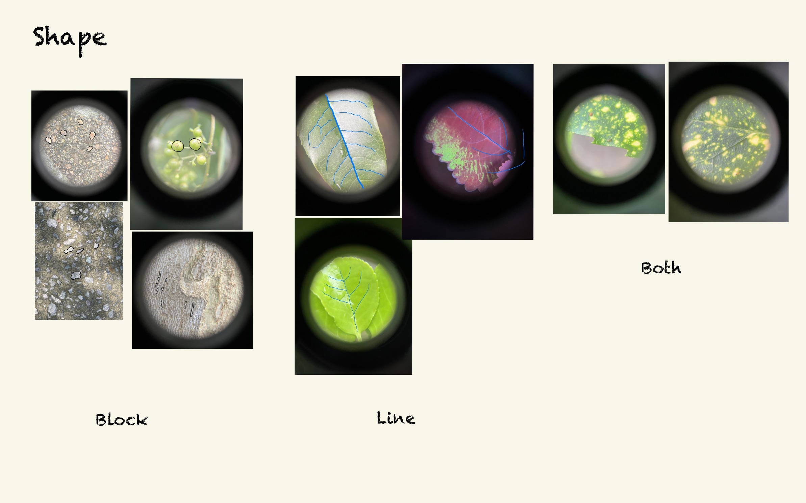

# Exploration

Hey guys, I am a student in Shanghai. On this weekend I went to a garden in our school and found something interesting.

Created by **LIU Xinyu**

Date: **2023/09/24**

# 1. Co-living of nature

Viewing the symbiotic relationships among natural entities from a personified perspective, natural elements in different scenarios can evoke diverse emotions, all of which are vivid and fascinating.

# 2. Sound of nature

A industrial equipment operating underwater creates a ‘wuuuuu~’ sound, as the water's flow stirs up a ‘ummmmm~’ sound, harmonizing with the cicadas' song ‘innnnn~’ in the trees. Together, humans and nature compose a symphony.

# 3. Shape of nature

Under a tenfold magnifying glass, the most obvious visual characteristics of shape of natural objects are blocks and lines.

# 4. Litter of nature

On a rainy day, many nature entities fall down, such as branches, leaves and flowers. Some of them land in the middle of the road, on top of car or simply rest comfortably on trees .

# 5. Summary

Generally speaking, I enjoyed this fieldwork though I was suffering from mosquito. I will do it continually.
