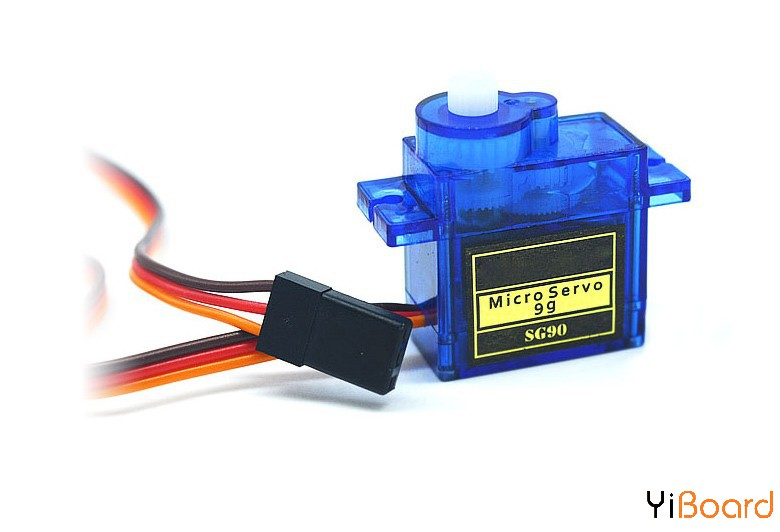
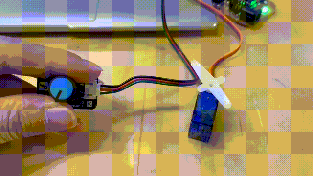
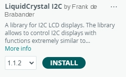
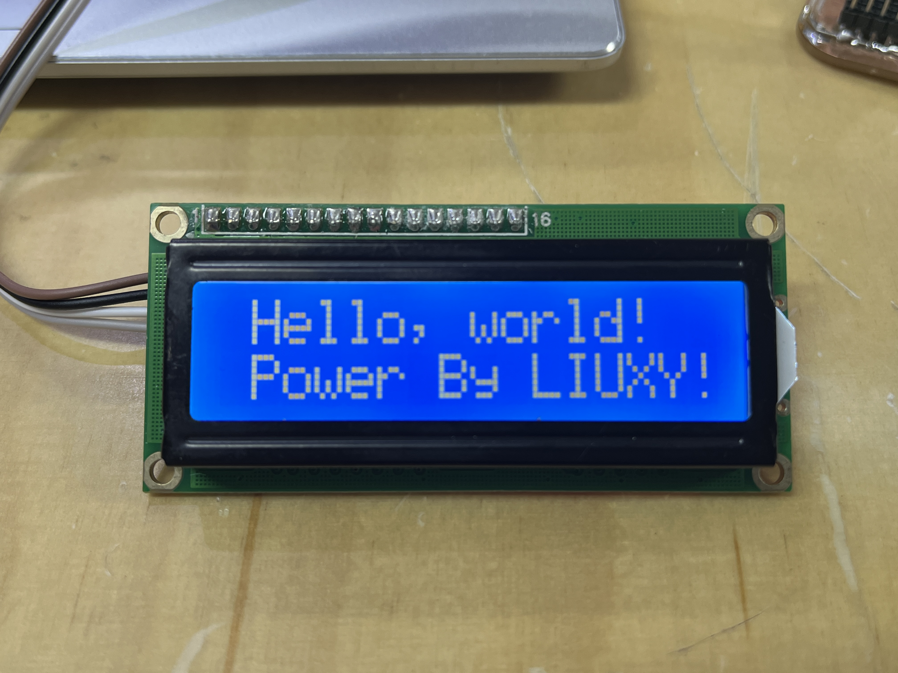
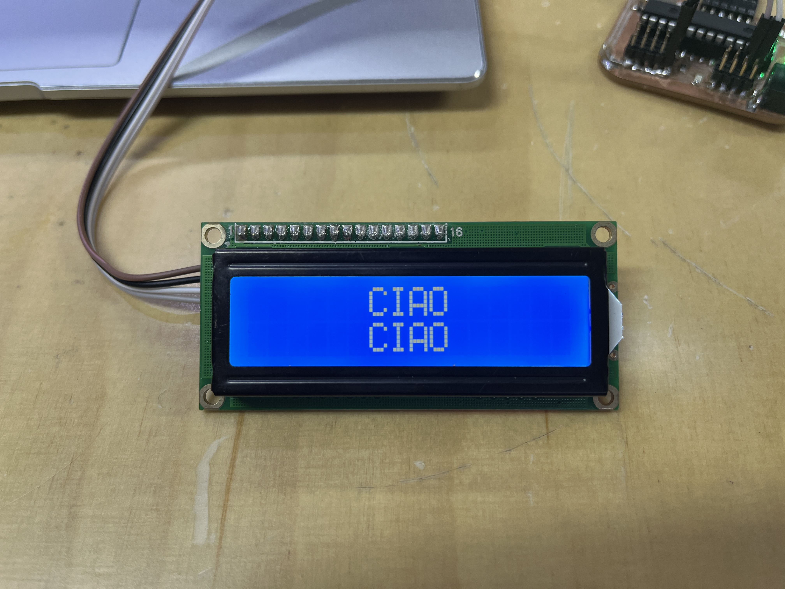

# Actuators


Hey guys, I am a student in Shanghai. On this week I learned some actuators and did experiments.

Created by **LIU Xinyu**

Date: **2023/10/19**


# 1. Servo motor



This is what we will learn today—servo motor.


Install this ‘Servo’ library in Arduino IDE and find the example ‘Knob’.

```arduino
#include <Servo.h>

Servo myservo;  // create servo object to control a servo

int potpin = A0;  // analog pin used to connect the potentiometer
int val;    // variable to read the value from the analog pin

void setup() {
  myservo.attach(9);  // attaches the servo on pin 9 to the servo object
}

void loop() {
  val = analogRead(potpin);            // reads the value of the potentiometer (value between 0 and 1023)
  val = map(val, 0, 1023, 0, 180);     // scale it for use with the servo (value between 0 and 180)
  myservo.write(val);                  // sets the servo position according to the scaled value
  delay(15);                           // waits for the servo to get there
}
```



You can use a rotation sensor to control this servo motor.


Or you can use a light sensor to do it. The principle is same that an input sensor gets data and an output actuator expresses these data to real action.

# 2. Fade LED

```arduino
int led = 9;         // the PWM pin the LED is attached to
int brightness = 0;  // how bright the LED is
int fadeAmount = 5;  // how many points to fade the LED by

// the setup routine runs once when you press reset:
void setup() {
  // declare pin 9 to be an output:
  pinMode(led, OUTPUT);
}

// the loop routine runs over and over again forever:
void loop() {
  // set the brightness of pin 9:
  analogWrite(led, brightness);

  // change the brightness for next time through the loop:
  brightness = brightness + fadeAmount;

  // reverse the direction of the fading at the ends of the fade:
  if (brightness <= 0 || brightness >= 255) {
    fadeAmount = -fadeAmount;
  }
  // wait for 30 milliseconds to see the dimming effect
  delay(30);
}
```


You can see the LED light continuously getting brighter and dimmer, cycling back and forth.

# 3. LCD Screeen



Install this ‘LiquidCrystal I2C’ library in Arduino IDE and find the example ‘Hello World’.

```arduino
#include <Wire.h> 
#include <LiquidCrystal_I2C.h>

LiquidCrystal_I2C lcd(0x27,20,4);  // set the LCD address to 0x27 for a 16 chars and 2 line display

void setup()
{
  lcd.init();                      // initialize the lcd 
  lcd.init();
  // Print a message to the LCD.
  lcd.backlight();
  lcd.setCursor(3,0);
  lcd.print("Hello, world!");
  lcd.setCursor(2,1);
  lcd.print("Ywrobot Arduino!");
   lcd.setCursor(0,2);
  lcd.print("Arduino LCM IIC 2004");
   lcd.setCursor(2,3);
  lcd.print("Power By Ec-yuan!");
}

void loop()
{
}
```





You can change words and positions to show different things.

# 4. Summary

This week we learned some actuators and they may play a role in the following study.

See you next week!
