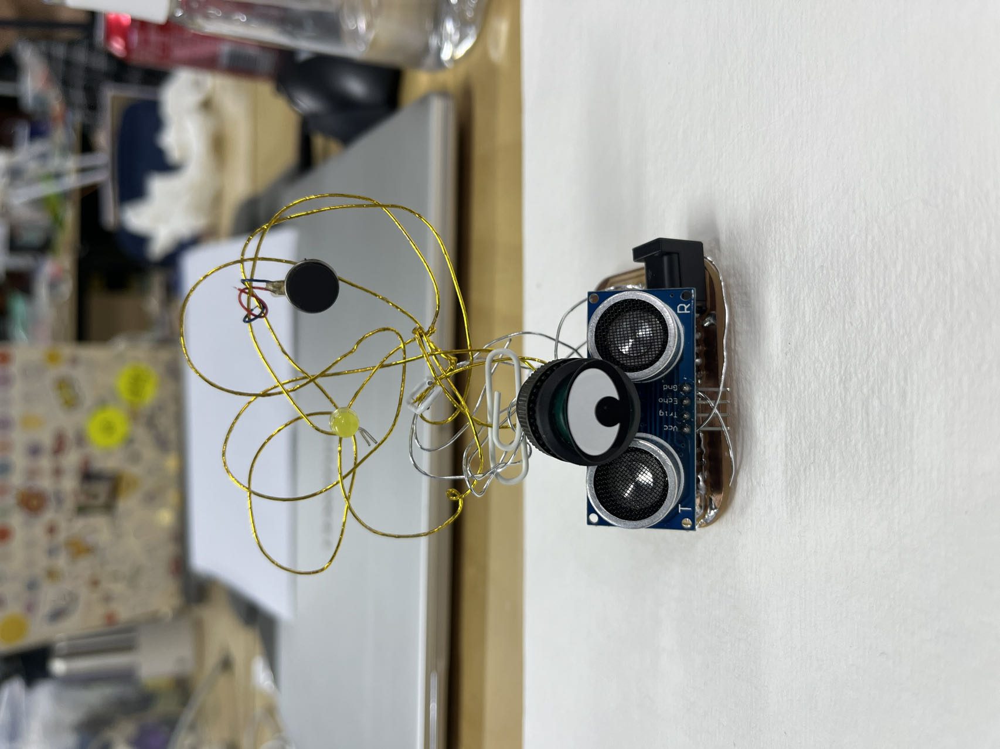
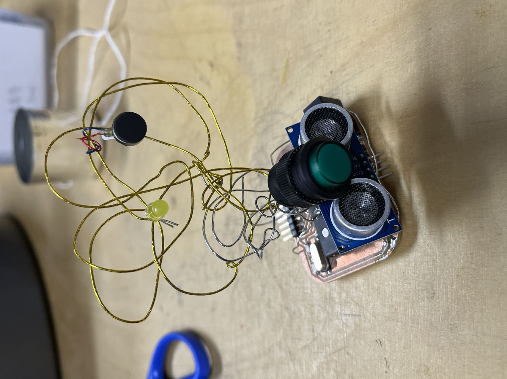

# Prototyping

Hey guys, I am a student in Tongji University. On this week I made a rapid prototype to show my design project.

Created by **LIU Xinyu**

Date: **2023/10/26**

# 1. Rapid prototype

My final project is about ‘**listen to plant**’.

In nature when plants are stressed, they will emit high frequency sounds which can not be heard by human. There are two stressing states: water shortage and animal approaching. So I use an ultrasonic sensor to simulate the animal approaching state. There we can use the data collected by sensor to control LED or vibrate motor or speaker.

