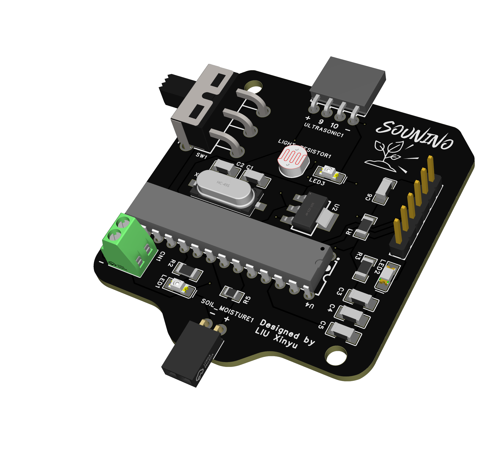
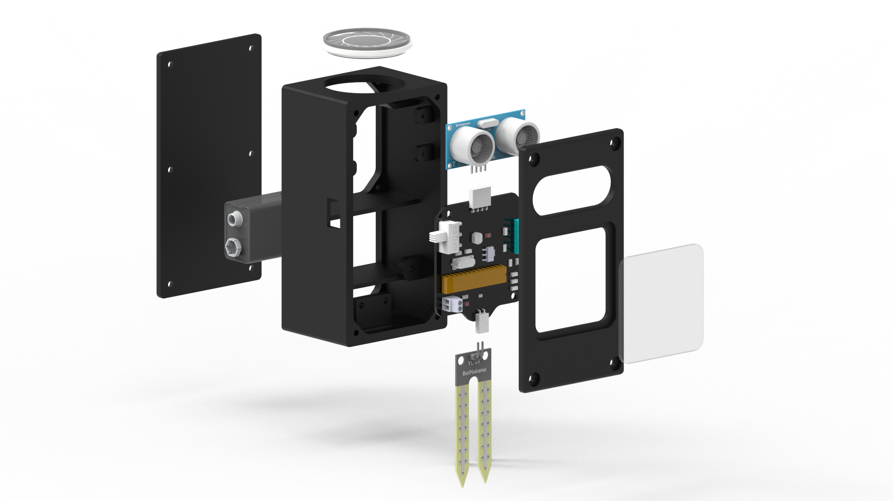

# Finalproject

Time has passed very quickly, and our tutorial is coming to an end. Today, I will show you the project that I have spent a month completing.

Created by **LIU Xinyu**

Date: **2023/11/16**

# 1. Introduction

My project’s name is ***植声微语(Plant Whisper)***.


***设计说明***  ***Design Description***

> 植物在受压状态下会发出高频率声音。
本项目是一个将植物声音外化的交互装置，以超声波传感器与土壤湿度传感器作为输入设备，分别模拟植物“遭受动物侵袭”和“缺水”两种条件，并影响输出设备——喇叭发出声音的音量大小与频率高低。
本项目为人类提供了与自然对话的新途径，让我们能够聆听到植物的声音，感知它们在环境中所传达的信息，从而促使人们更加深刻地思考和理解与自然的共生关系。

Plants emit high-frequency sounds under pressure.
This project is an interactive device that externalizes the sounds of plants, using ultrasonic sensors and soil moisture sensors as input devices. It simulates two conditions for plants, 'animal approaching' and 'water shortage,' influencing the output device – a speaker that modulates volume and frequency based on these simulated conditions.
The project provides a new way for humans to engage in dialogue with nature, allowing us to listen to the sounds of plants and perceive the information they convey in their environment. This encourages people to contemplate and deepen their understanding of the symbiotic relationship with nature.
> 

# 2. PCB design


This is the schematic. The most ingenious part is that I use one LED and photoresistors to achieve the effect of a digital potentiometer.





# 3. Supplies and soldering


Things I need.


# 4. Appearance design

Since the three devices I used (ultrasonic sensor, soil moisture sensor, and horn) had distinctive shapes, I decided to make a little man box with eyes and legs.




There are name and logo of my PCB on the acrylic board.

# 5. Coding

```arduino
// 定义超声波传感器的引脚
#define TRIGGER_PIN 9
#define ECHO_PIN 10

// 定义土壤湿度传感器的引脚
#define SOIL_SENSOR_PIN A0

// 定义LED灯的引脚
#define LED_PIN 5

// 定义喇叭的引脚
#define SPEAKER_PIN 6

// 定义全局变量
long duration;
int distance;

void setup() {
  // 初始化串口通信
  Serial.begin(9600);

  // 设置LED灯、喇叭的引脚为输出
  pinMode(LED_PIN, OUTPUT);
  pinMode(SPEAKER_PIN, OUTPUT);
  pinMode(TRIGGER_PIN, OUTPUT);
  pinMode(ECHO_PIN, INPUT);
  
  // 初始化LED灯状态
  digitalWrite(LED_PIN, LOW);
}

void loop() {
  // 读取超声波传感器的距离
  digitalWrite(TRIGGER_PIN, LOW);
  delayMicroseconds(2);
  digitalWrite(TRIGGER_PIN, HIGH);
  delayMicroseconds(10);
  digitalWrite(TRIGGER_PIN, LOW);
  duration  = pulseIn(ECHO_PIN, HIGH);
  distance= duration*0.034/2;

  // 读取土壤湿度传感器的值
  int soilMoisture = analogRead(SOIL_SENSOR_PIN);

  // 根据土壤湿度来设置喇叭的音调
  int toneFrequency = map(soilMoisture, 0, 1023, 2000, 200);
  tone(SPEAKER_PIN, toneFrequency);

  // 控制LED灯的亮度，通过LED光线照射光敏电阻
  int ledBrightness = map(distance, 2, 80, 255, 0);
  if(ledBrightness < 0){
  ledBrightness=0;
  }
  analogWrite(LED_PIN, ledBrightness);

  // 打印传感器值到串口
  Serial.print("Distance: ");
  Serial.print(distance);
  Serial.print(" cm");
  Serial.print("    LED: ");
  Serial.print(ledBrightness);
  Serial.print("    Soil Moisture: ");
  Serial.print(soilMoisture);
  Serial.print("    Tone Frequency: ");
  Serial.println(toneFrequency);

  delay(1000);  // 延迟一秒钟，减小输出频率

  noTone(SPEAKER_PIN);

  delay(1000);  // 延迟一秒钟，减小输出频率
}
```
